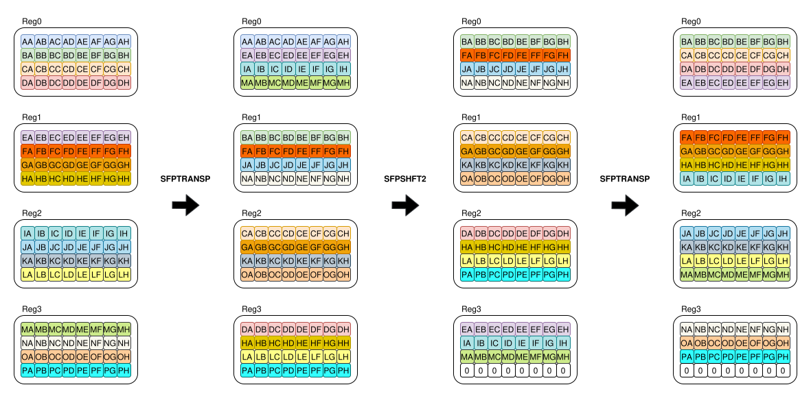

# Vertical FP32 SFPU stencil

The production vertical stencil primitive is implemented in
[`vertical_stencil_sfpi.h`](../tt-wavelet/kernels/sfpi/vertical_stencil_sfpi.h).

For a column signal `f` and filter `h`, the valid output is:

$$
g[i] = \sum_{j=0}^{K-1} h[j] f[i-j].
$$

The implementation processes the window bottom-to-top. A transpose, chained four-register copy, and transpose back shift four SFPU registers upward by one row:

```cpp
SFPTRANSP();
SFPSHFT2(0, 0, 0, SFPSHFT2_MOD1_SUBVEC_CHAINED_COPY4);
SFPNOP();
SFPTRANSP();
```



Register capacity selects one of three compile-time output heights:

- `K < 6`: 12 valid rows;
- `K < 10`: 8 valid rows;
- `K >= 10`: 4 valid rows.

For `K = 14..17`, four output rows need at most 20 source rows. The kernel
therefore uses two source segments while keeping the FP32 output accumulator
live:

1. taps `0..12` use the original four-register source window;
2. source rows `r+12..r+27` are reloaded;
3. one rotate aligns the window at `r+13`;
4. taps `13..K-1` continue into the same accumulator.

No partial result is written to L1, so the coefficient order and FP32 MAD
sequence are unchanged.

Unlike the horizontal stencil, columns do not need even/odd decomposition or
an explicit cross-register masked move. This primitive is used by the
production 2D LWT and ILWT compute kernel. Validate the high-order paths with
the production executables and the synthetic `K=17` scheme; a device run is
required to JIT-compile the SFPI kernel.
